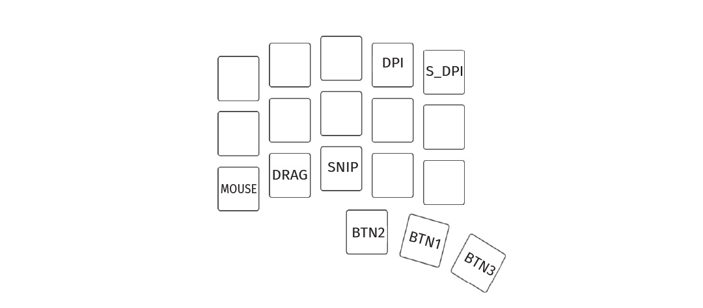

# Table of contents

1. TOC
{:toc}

# Introduction

Congratulations on successfully building your keyboard!

The Bastard Keyboards come with a range of features, and it's also easy to customize them. On this page you will find additional information on how to use them and make them your own.

# Daily use

## Default keymap

You can find pictures of the default keymaps on the [default keymaps page][keymaps].

Alternatively, you can also plug in your keyboard and visualize the keymap using VIA (see VIA section).

## Using the trackball / trackpad

If you prefer a video, how to use your trackball/trackpad keyboard is detailed here: [video](https://www.youtube.com/watch?v=XjFAvW-78bE).

Holding down the `MOUSE` key (lower left, see picture) activates the mouse layer.
On it, you will find a lot of useful features.

The most important ones are on the thumb cluster - it transforms into mouse buttons!

- `mouse + BTN1`: Left click
- `mouse + BTN2`: Right click
- `mouse + BNT3`: Middle click

### Sniping 

Sniping **slows down the trackball**. This way, you can move the cursor more precisely.

By default, Sniping mode is activated when you hold the `MOUSE + SNIP` keys at the same time.
You can also configure qmk to have it activated automatically.

## Miryoku

The 3x5 keyboards (Skeletyl, Charybdis Nano) come flashed with [Miryoku](https://github.com/manna-harbour/miryoku). On its github repository you will find useful information on the different layers available.

# Customization

You can find the latest **default images** for all Bastard Keyboards in the release section of the [BastardKB QMK fork](https://github.com/Bastardkb/bastardkb-qmk/releases).

You can find instructions on **how to flash your keyboard** with a new image here: [flashing][How to flash your keyboard].

## Using VIA

All Bastard Keyboards come flashed with VIA. You can open the [VIA Web Interface through use.via.app](https://usevia.app/). At the moment, only WebHID-enabled browsers work (eg. Chrome and Chromium-based).

You can check the following tutorial on how to use it:


Through VIA, you can customize:
- the keymap
- macros, layers
- RGB

## Using QMK

For how to flash your keyboard, take a look at the [how to flash your keyboard page][flashing].

For **advanced customization of the Charybdis and Charybdis Nano**, take a look at the [customize page][customize].

---

[customize]: {{site.baseurl}}/fw/charybdis-features.html
[keymaps]: {{site.baseurl}}/fw/default-keymaps.html
[flashing]: {{site.baseurl}}/fw/flashing.html