# Table of contents

1. TOC
{:toc}

# Introduction

In this section we will prepare the Splinktegrated. The Splinktegrated is an open-source board based on the RP2040 controller, which acts as the "brains" of your keyboard.

{: .tip }
In your kit, you might get either a Splinky with shield PCB, or a Splinktegrated. If you have a Splinky, refer to the Splinky guide.

**Please read all the instructions first, and then follow them carefully using the pictures.**

{: .warning }
> Do not install the audio jack and reset button yet.
> 
> You will need to prepare one **"Right"** shield PCB, and one **"Left"** - use the legends on the PCB.
> 
> We will start with preparing the headers, then the left side, and after that do the right side.

# Headers
## Headers - Required parts

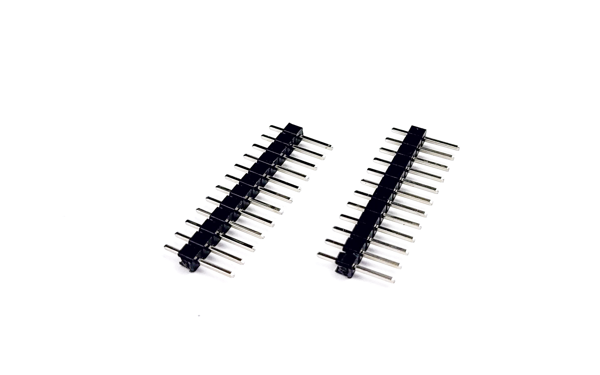

**For the following step, please prepare:**
- 12-pin header (x2)

Using pliers, cut the headers into pieces of **4 pins**:
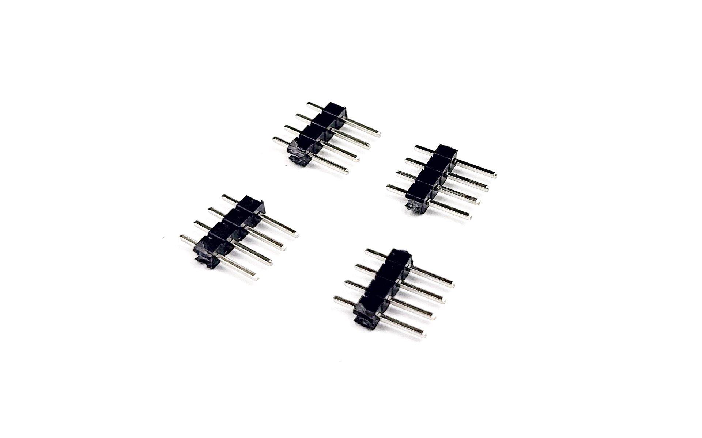

You only need 4 pieces, you can set the other ones aside.

# Left side
## Left side - Required parts

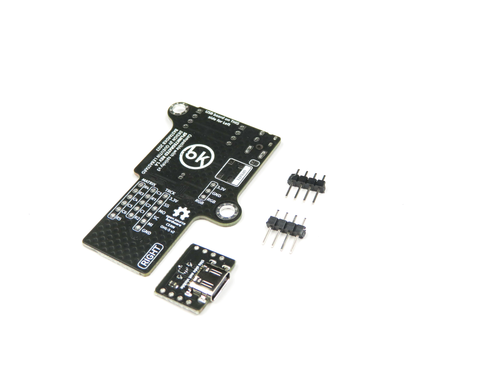

**For the following step, please prepare:**

- 4-pin header (x2)
- Splinktegrated main board
- Splinktegrated daughter board

{: .warning }
In the next section, we will prepare the first Splinktegrated by installing the daughterboard onto the motherboard. **It is very important to install it on the correct side**, otherwise it will not work. Make sure to look at the pictures carefully! 

## Left side - Installing the daughterboard

- Install the headers onto the motherboard
- Install the daughterboard on top
- **Double check against the picture that it is on the correct side**
- Use normally-closed pliers to hold it

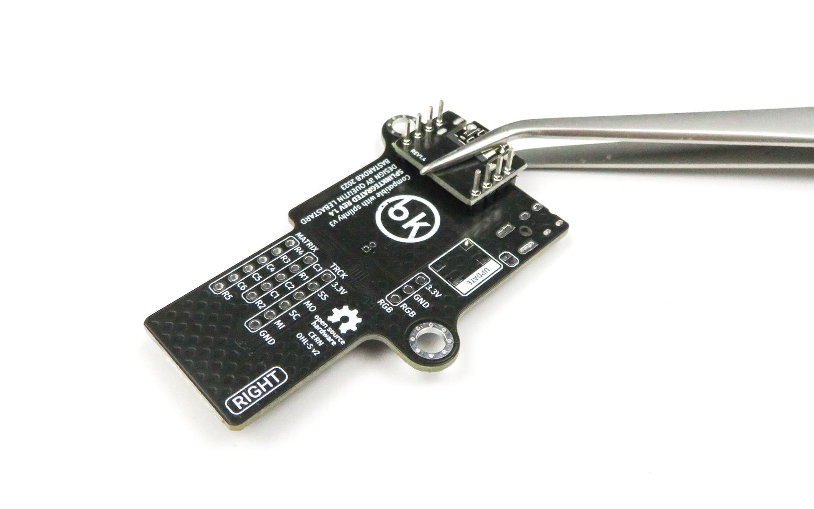

- **At all times, make sure the daughterboard is pressed against the motherboard**
- There should be no gap between the daughterboard, the header pins, and the motherboard

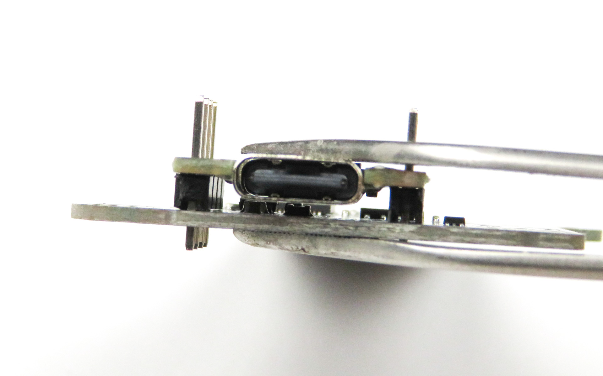

- Inspect the front of the assembly: 
- Make sure that the headers are flush with the motherboard and daugtherboard
- Solder the top headers, then the bottom headers
- Finally, cut the headers to make them flush using pliers

## Left side - Reset button

{: .warning }
The reset button needs to be installed on a specific side. Read the instructions and inspect the pictures carefully first, then proceed with the soldering.

**For the following step, please prepare:**

- Splinktegrated assembly (left)
- Reset button

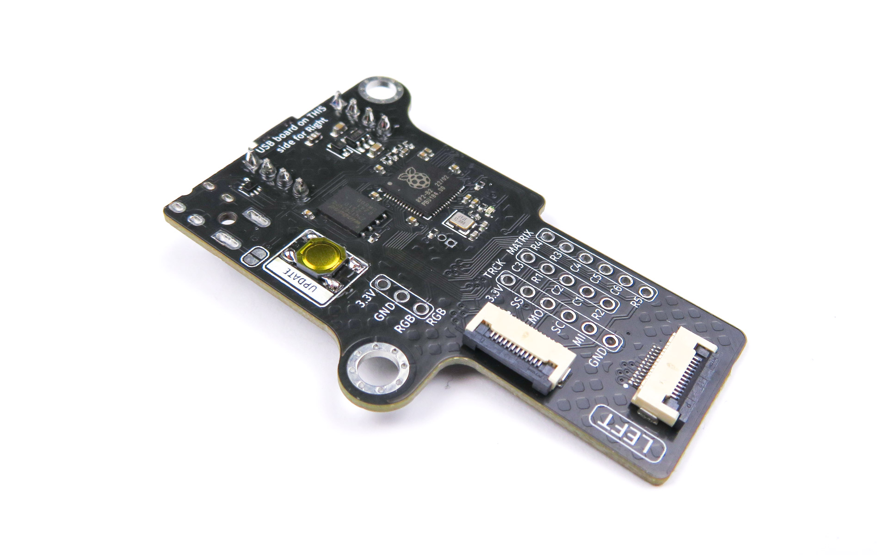

- Flip the assembly
- Solder the reset button
- Use the same technique as the diodes (pre-tin one pad) 

## Left side - Jumper

{: .warning }
The jumper needs to be installed on a specific side. Read the instructions and inspect the pictures carefully first, then proceed with the soldering.

Use the picture to identify the jumper. 

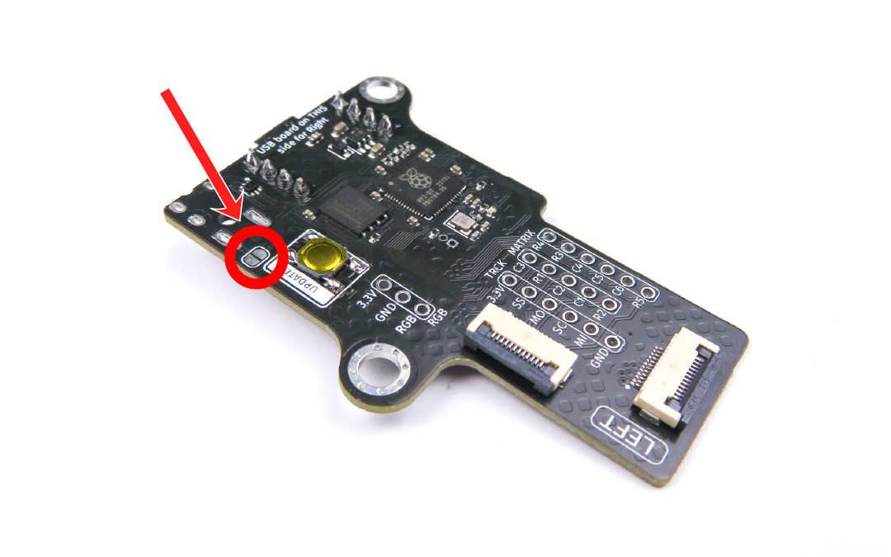

Solder the jumper, so that the 2 pads are bridged together.

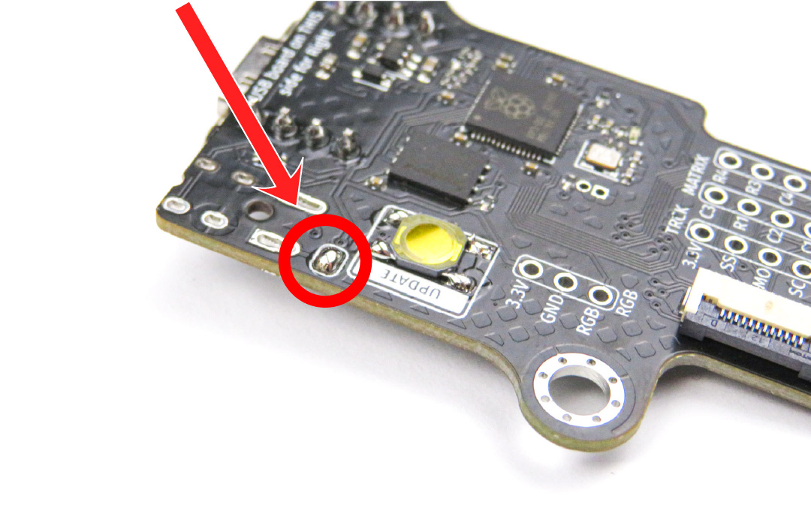

## Left side - Audio jack

{: .warning }
In this step, we will solder the audio jack. At this point, we will only solder one pad (the 5V). This is so that later we can adjust its exact position once it's inserted into the 3d case. The audio jack needs to be installed on a specific side. Read the instructions and inspect the pictures carefully first, then proceed with the soldering.

**For the following step, please prepare:**

- Splinktegrated assembly (left)
- Audio jack

- Install the audio jack
- **Solder only the bottom left pin . We will align the audio jack in the case and solder the other pins later**

# Right side
## Right side - Required parts

**For the following step, please prepare:**

- 4-pin header (x2)
- Splinktegrated main board
- Splinktegrated daughter board

{: .warning }
In the next section, we will prepare the first Splinktegrated by installing the daughterboard onto the motherboard. **It is very important to install it on the correct side**, otherwise it will not work. Make sure to look at the pictures carefully! 

## Right side - Installing the daughterboard

- Install the headers onto the motherboard
- Install the daughterboard on top
- **Double check against the picture that it is on the correct side**
- Use normally-closed pliers to hold it

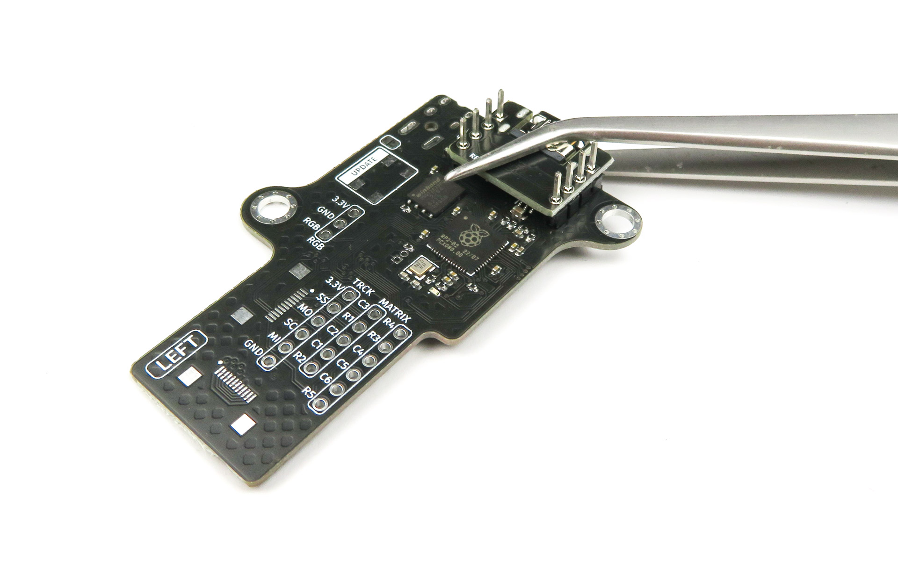

- **At all times, make sure the daughterboard is pressed against the motherboard**
- There should be no gap between the daughterboard, the header pins, and the motherboard

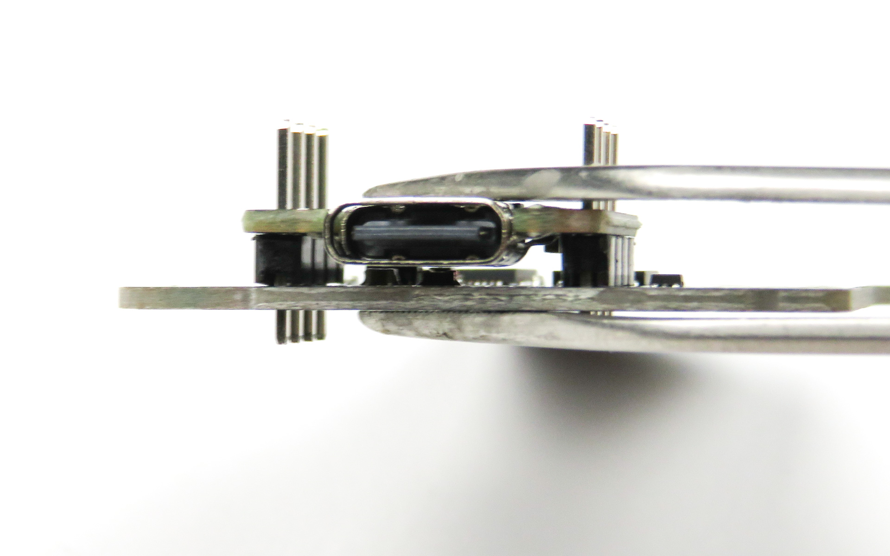

- Inspect the front of the assembly: 
- Make sure that the headers are flush with the motherboard and daugtherboard
- Solder the top headers, then the bottom headers
- Finally, cut the headers to make them flush using pliers

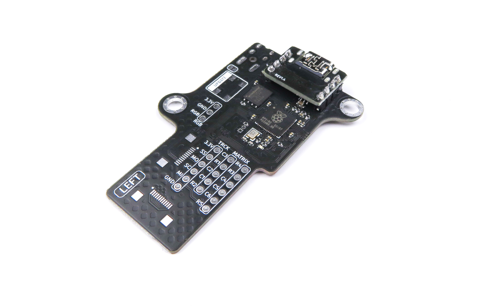

## Right side - Reset button

{: .warning }
The reset button needs to be installed on a specific side. Read the instructions and inspect the pictures carefully first, then proceed with the soldering.

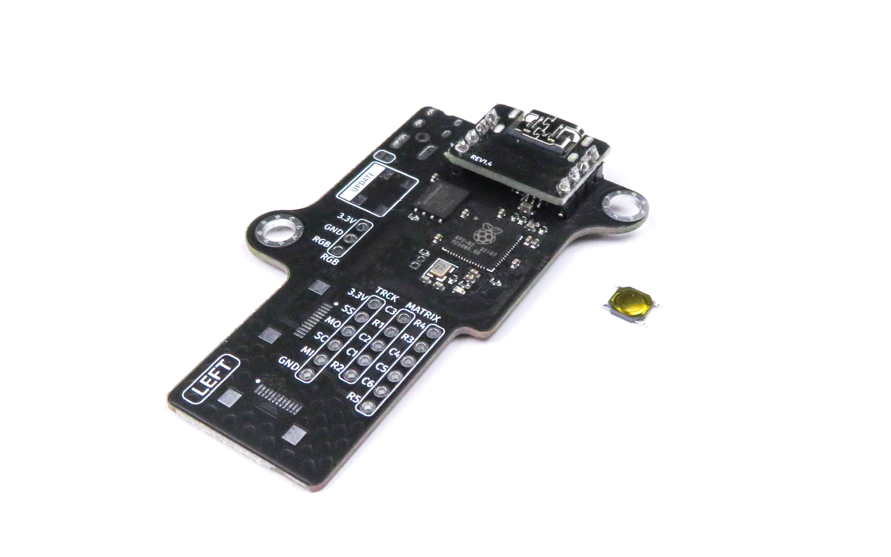

**For the following step, please prepare:**

- Splinktegrated assembly (right)
- Reset button

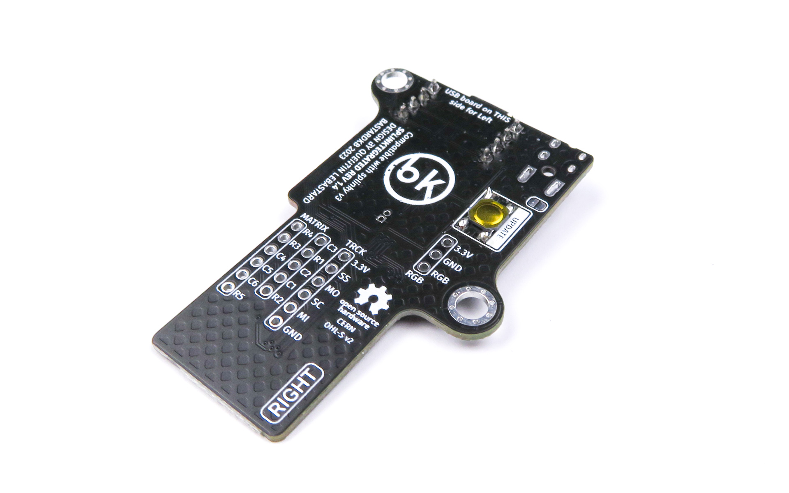

- Flip the assembly
- Solder the reset button
- Use the same technique as the diodes (pre-tin one pad) 

## Right side - Jumper

{: .warning }
The jumper needs to be installed on a specific side. Read the instructions and inspect the pictures carefully first, then proceed with the soldering.

Use the picture to identify the jumper. 

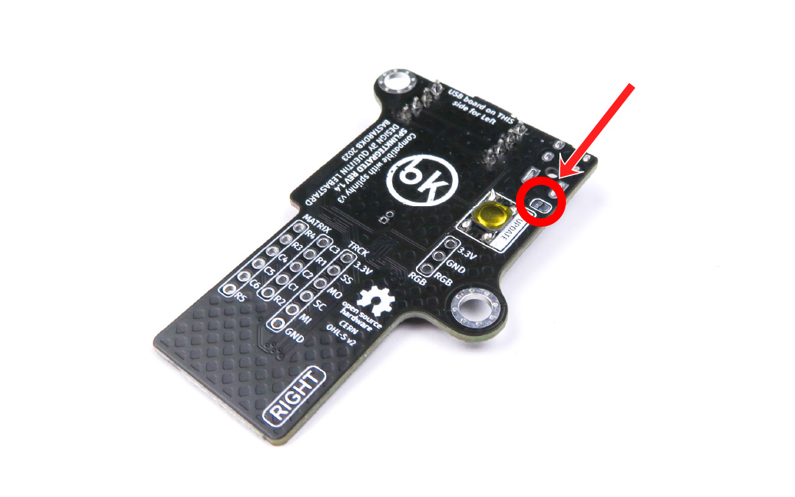

Solder the jumper, so that the 2 pads are bridged together.

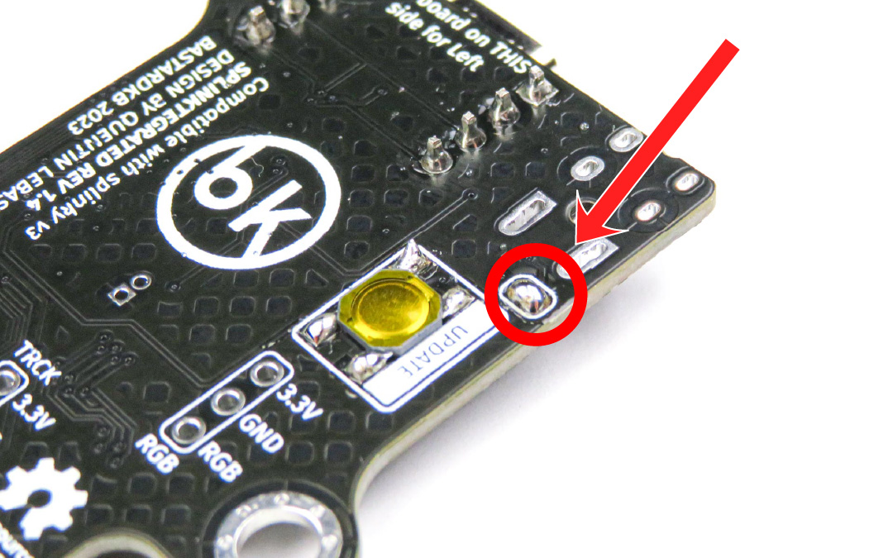

## Right side - Audio jack

{: .warning }
In this step, we will solder the audio jack. At this point, we will only solder one pad (the 5V). This is so that later we can adjust its exact position once it's inserted into the 3d case. The audio jack needs to be installed on a specific side. Read the instructions and inspect the pictures carefully first, then proceed with the soldering.

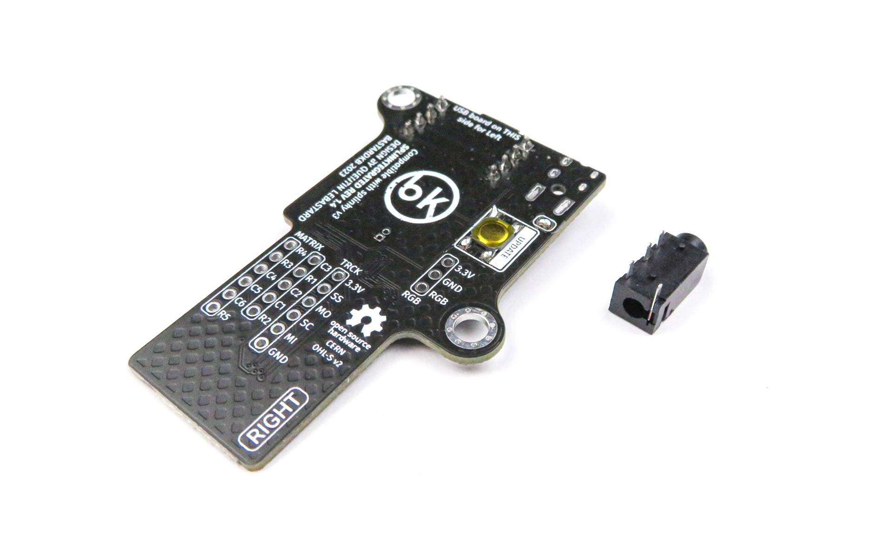

**For the following step, please prepare:**

- Splinktegrated assembly (right)
- Audio jack

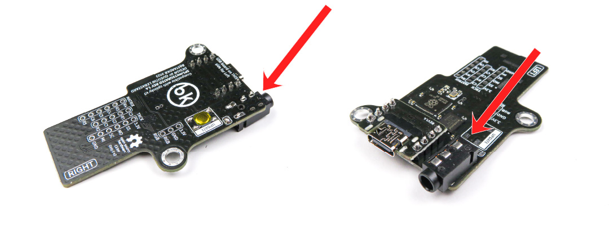

- Install the audio jack
- **Solder only the bottom left pin . We will align the audio jack in the case and solder the other pins later**

# Checkup

You now have 2 Splinktegrated assemblies. Make sure they match with the pictures below. **Pay close attention to the audio jack, reset button, and jumper**.

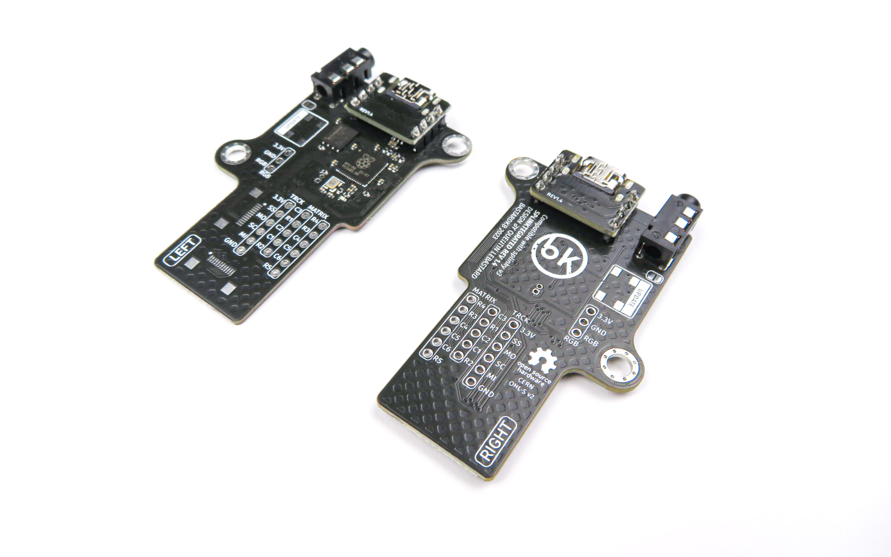

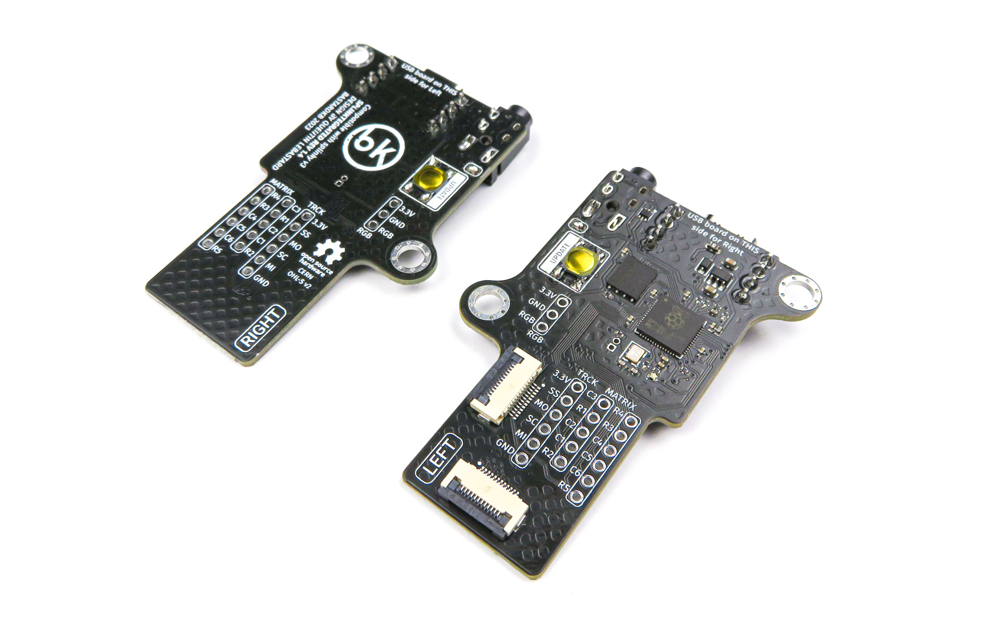