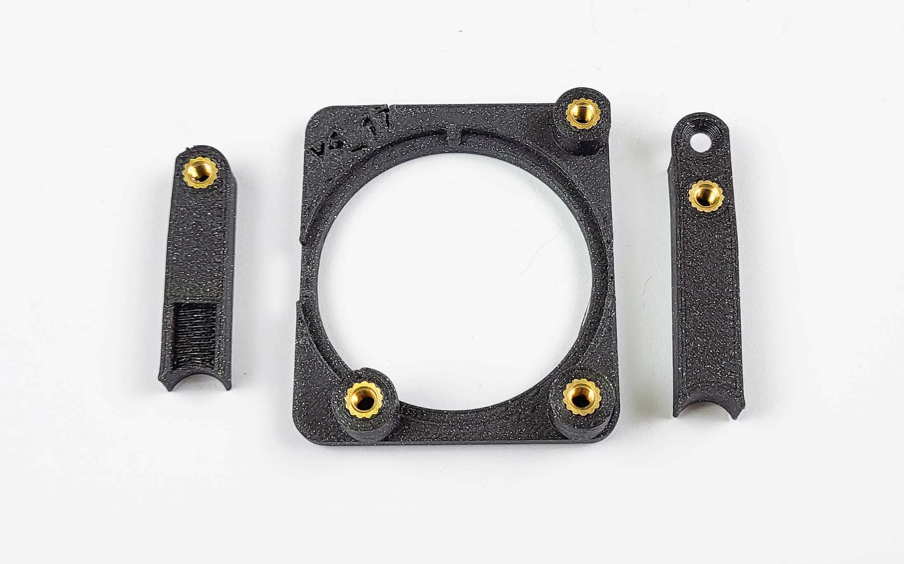
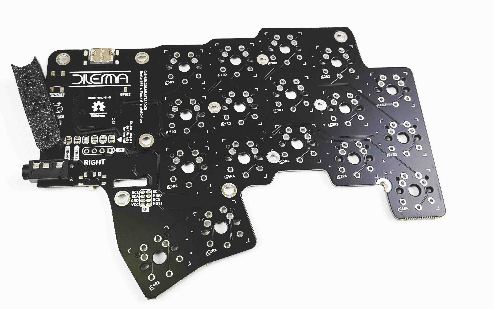
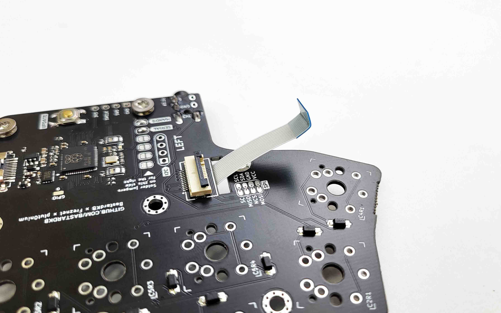
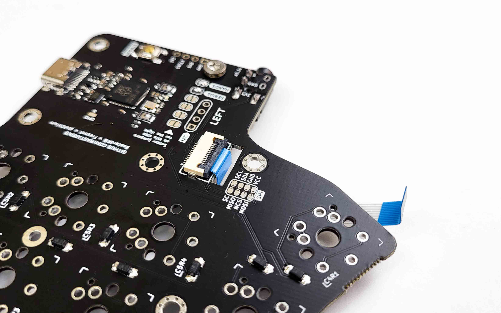
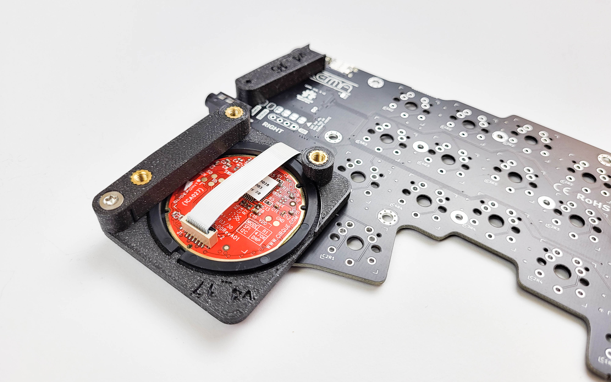
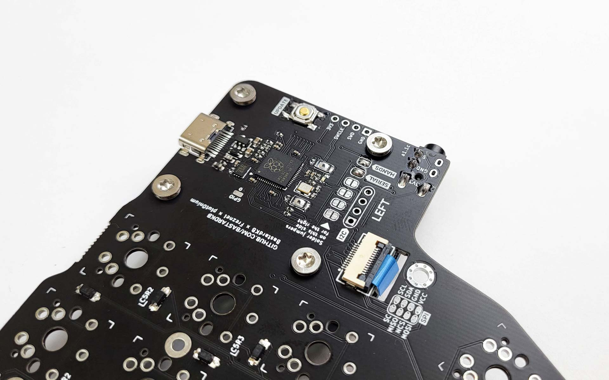

# Table of contents

1. TOC
{:toc}

# Soldering the headers and reset button

- Locate the text that says: `Solder jumpers on this side for the right` (in blue on the picture below)
- Solder the `Serial` and `Hands` jumpers
- If you are using an OLED/any I2C device, also solder the other 4 jumpers
- Solder the reset button
- Do the same thing for the left (in yellow on the picture below).

# Soldering the audio jacks

- Flip the boards
- Solder in the audio jacks
- Check that orientation is the same as on the picture below

# Preparing the trackpad assembly

Install the 5 screw inserts:

- Set your soldering iron temperature to 200 degrees Celsius
- Using the soldering iron, place the heated insert inside the hole
- Apply little to no pressure, let the gravity do the work. Otherwise, you might push them too far
- If the insert doesn’t fall into place, you can slowly increase the temperature, but don’t go over 300 degrees
- Once the insert is 2/3 of the way in, stop
- Flip over the print and gradually push it against a flat surface, to make the insert flush with the print
-  Move the parts aside and let them rest, while they cool down

Install the left 3d print holder. Do not screw it in completely, we will do this later.

- Slide the trackpad into the assembly. Align the notch, just like on the picture below (at the bottom)
- Screw in the retainer

# Connecting the trackpad ribbon cable

Please note: you do not need to desolder any resistors on the trackpad. Just use it as it came in the kit !

Bend the cable like on the picture below :

- On the Right side of the keyboard, pass the cable from the top in the hole, just like in the picture below
- Open the ribbon connector

- Insert the ribbon in the connector
- Make sure you have the same orientation as in the picture below - blue facing up !
- Close the ribbon connector

# Connecting the trackpad assembly

- Connect the other side of the ribbon cable into the trackpad assembly
- Make sure you install it like on the picture below - the blue part on the same side as the black dot

Screw in the trackpad assembly. Tighten all 4 screws.

When installing it, you will need to rotate the assembly and twist the cable. Be careful with it, and avoid fiddling with it as it can break easily.

# Test the PCB

This step is optional, but highly recommended.

- Connect the keyboard to your computer - it comes pre-flashed with QMK
- Check that the cursor moves when you use the trackpad
- Using tweezers, short 2 pins of a switch. Check that it registers

# Soldering the switches

Solder in your switches of preference.

# Customize your firmware

You're all done !

Head over to [bstkbd.com/custom](https://bstkbd.com/custom) to customize your keyboard to your needs.

If you need any help with it, make sure to hop on the discord : [bstkbd.com/discord](https://www.bstkbd.com/discord)