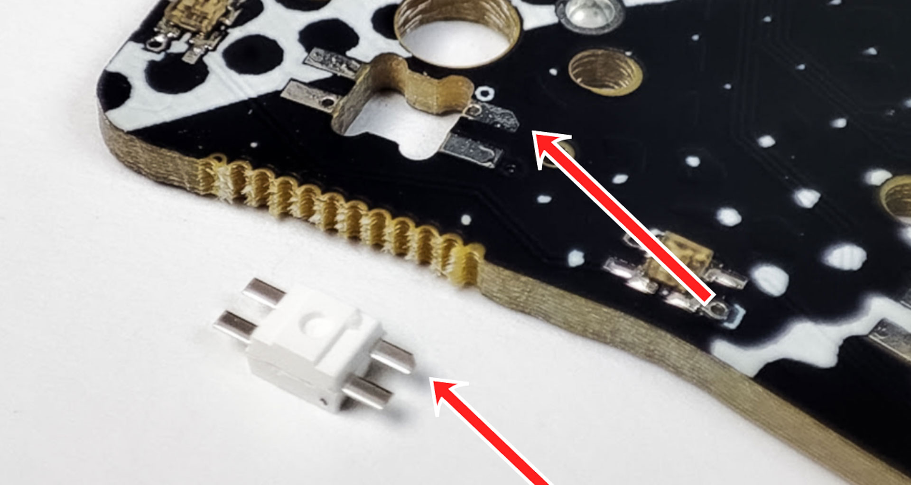
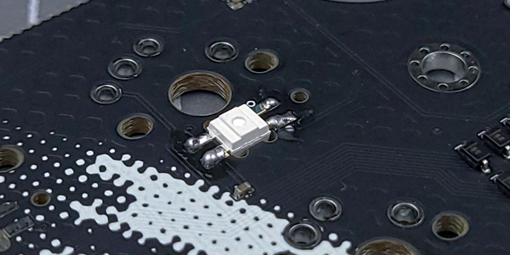
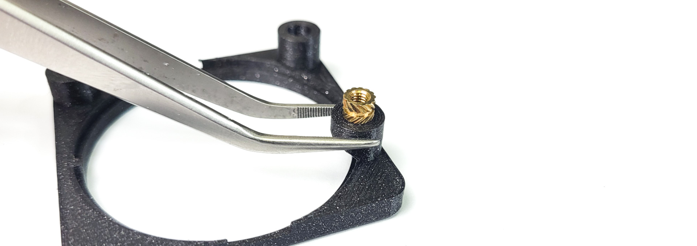
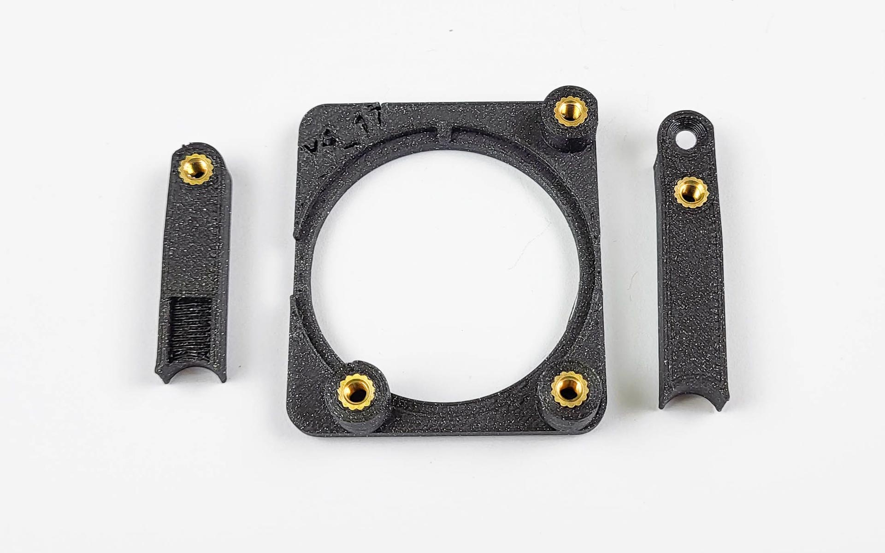
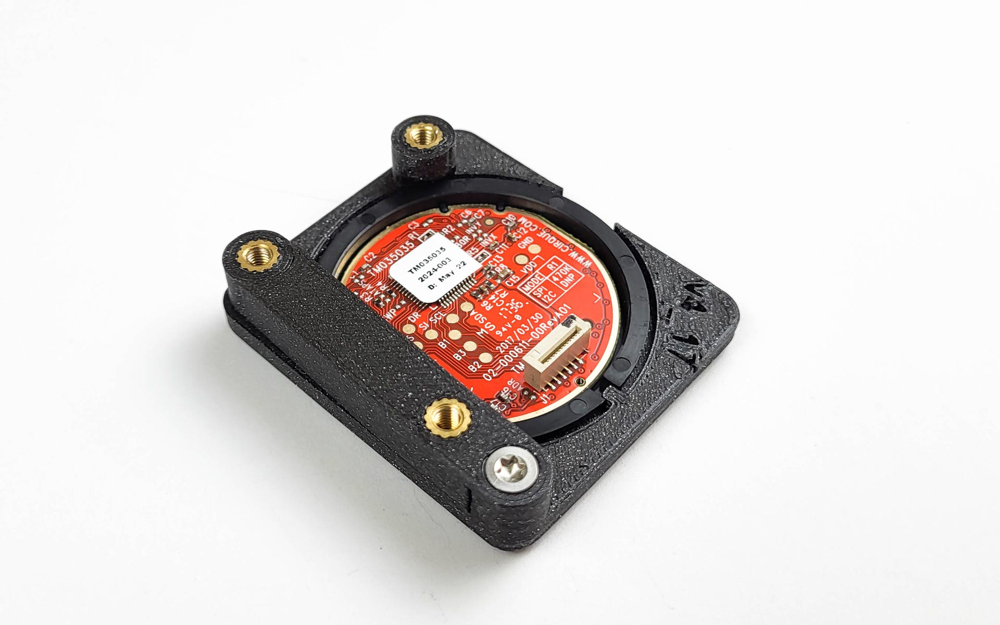
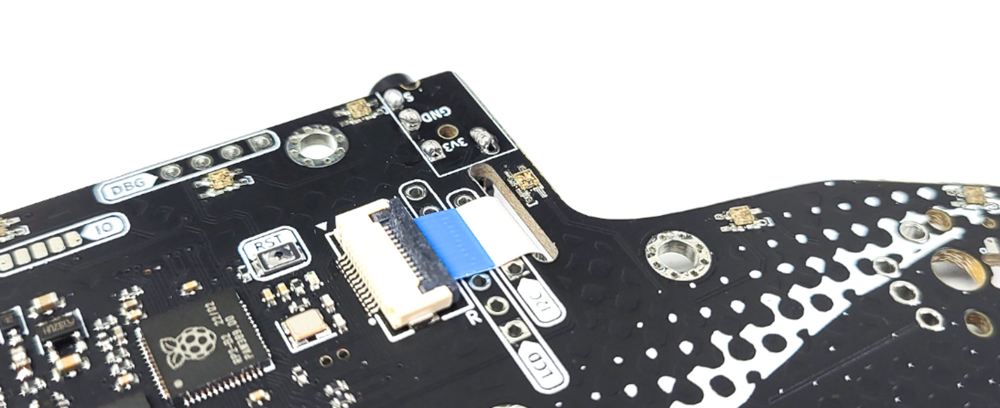
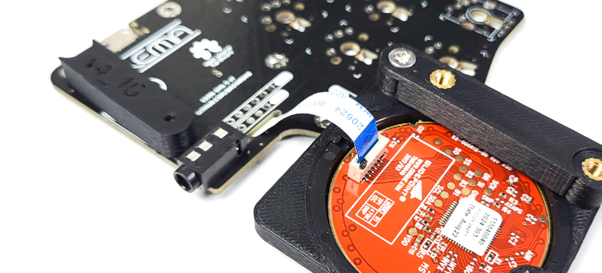
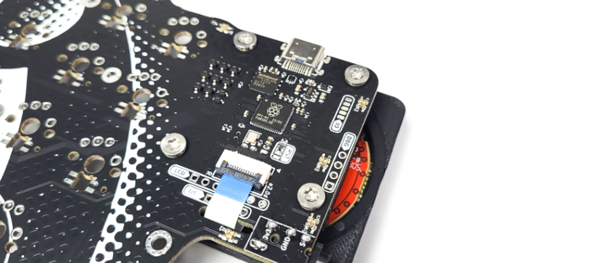

# Table of contents

1. TOC
{:toc}

# Installing the per-key RGB

If you ordered a kit with per-key RGB, we will start by installing those. If you don't have LEDs, you can skip to the next section.

{: .warning }
The LEDs need to be installed in a very specific way. Read the following instructions carefully first, and then install them. If you don't, they will not work! 

Inspect the LED: there is one of the pins that has a slight chamfer in it. The plastic casing also has an indent. This is **the GROUND pin**. 

- Inspect the PCBs: for each LED footprint, there is one pin that has a white dot next to it
- All the LEDs are installed in the same direction. If one dot is obscured by the silkscreen, just install the LED the same way as the others
- **We need to match the chamfered pin of the LED, with the marked pin on the PCB**

{: .warning }
The LEDs are sensitive to heat. Stay at most 2 seconds on each pad. If that doesn't work, try slowly increasing the temperature of your soldering iron.

- Install the LEDs
- Solder them pad by pad
- Go through the LEDs one by one

# Soldering the audio jacks and reset buttons

- There is only one way the components can be installed, so there's no risk of messing up!
- Solder in the audio jacks
- Solder in the reset buttons-   **When installing the reset button, take care not to short the pads to the vias nearby.** 
- The vias are the round metal holes.

# Preparing the trackpad assembly

Install the 5 screw inserts:

- Set your soldering iron temperature to 200 degrees Celsius
- To make it easier, use pliers to hold the 3d print
 

-   Using the soldering iron, place the heated insert inside the hole
-   *Apply little to no pressure, let the gravity do the work*. Otherwise, you might push them too far
-   If the insert doesn't fall into place, you can slowly increase the temperature, but don't go over 300 degrees
-   Once the insert is 2/3 of the way in, stop
-   Flip over the print and gradually push it against a flat surface, to make the insert flush with the print
-   Move the parts aside and let them rest, while they cool down

{: .tip }
The kit comes with grey screws. If you ordered a case, you will also get black screws. For this step, use the grey screws. 

-   Install the first part of the 3d print holder on the right side PCB. **Do not screw it in completely**, we will do this later.

-   Slide the trackpad into the assembly. Align the notch, just like on the picture below (at the bottom)
-   Screw in the retainer

# Connecting the trackpad ribbon cable

**Please note**: you **do not need** to desolder any resistors on the trackpad. Just **use it as it came in the kit!**

-   On the **Right side of the keyboard**,
-   Open the FPC connector
-   Slide the cable in like on the picture below
-   Close the FPC connector

-   Slide the other end of the cable into the slot

# Connecting the trackpad assembly

-   Connect the other side of the ribbon cable into the trackpad assembly
-  **Make sure you install it like on the picture below - the blue part on the same side as the black dot**

- If you don't have a case, screw in the 4 screws and tighten them like on the picture below
- If you have a case, read the instructions in the case page, after installing the switches.

# Test the PCB

This step is optional, but highly recommended.

- Connect the keyboard to your computer - it comes pre-flashed with QMK
- Check that the cursor moves when you use the trackpad
- Using tweezers, short 2 pins of a switch. Check that it registers

# Soldering the switches

Solder in your switches of preference.

# Customize your firmware

You're all done!

Head over to [bstkbd.com/custom](https://bstkbd.com/custom) to customize your keyboard to your needs.

If you need any help with it, make sure to hop on the discord : [bstkbd.com/discord](https://www.bstkbd.com/discord)
