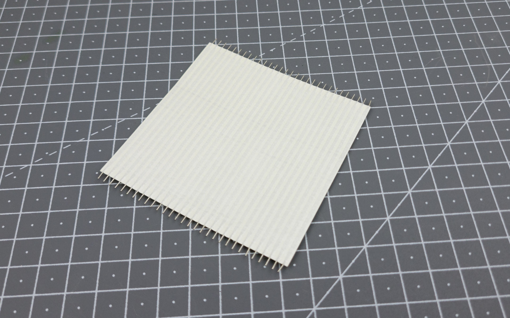
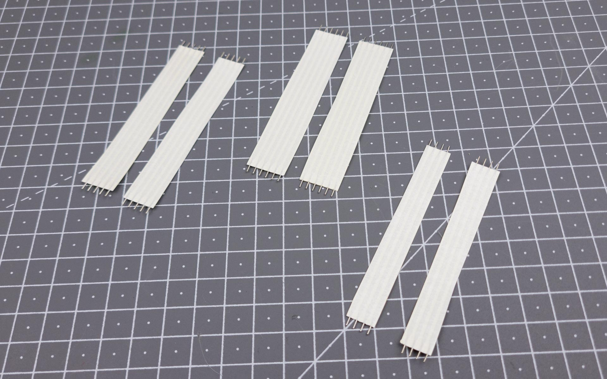
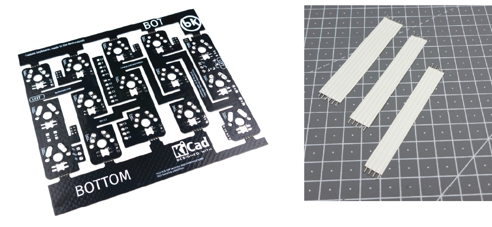
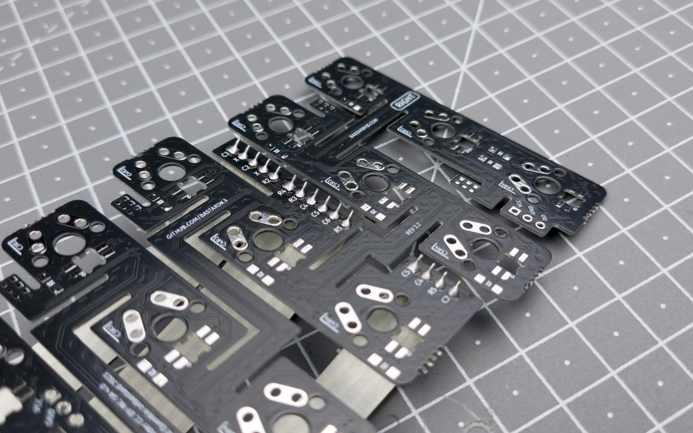
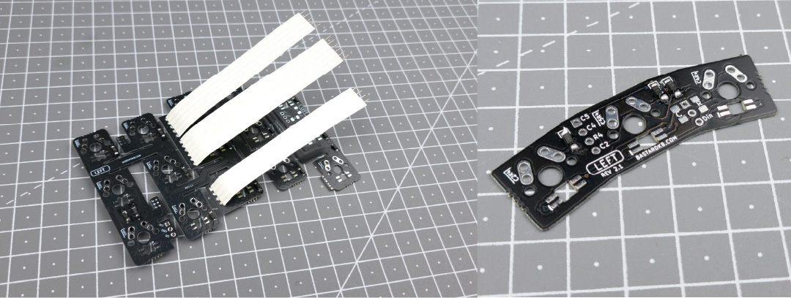
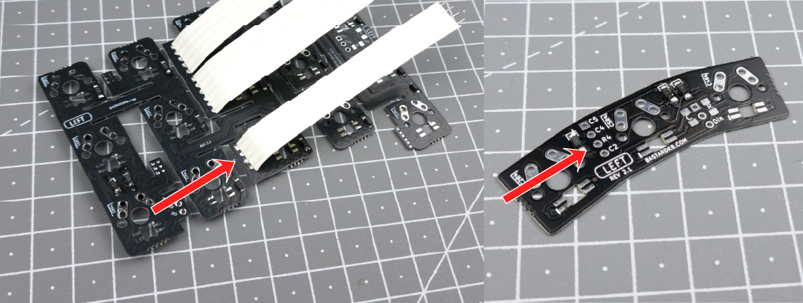
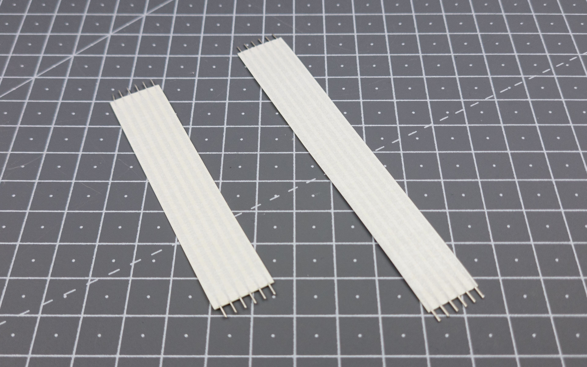
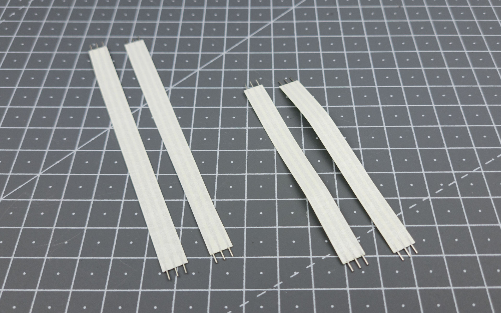
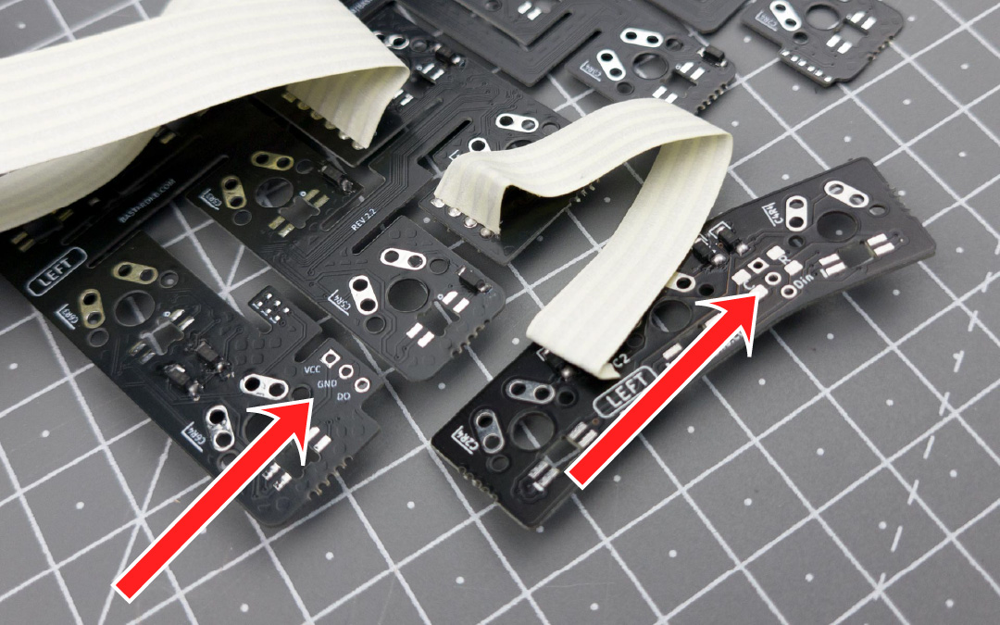
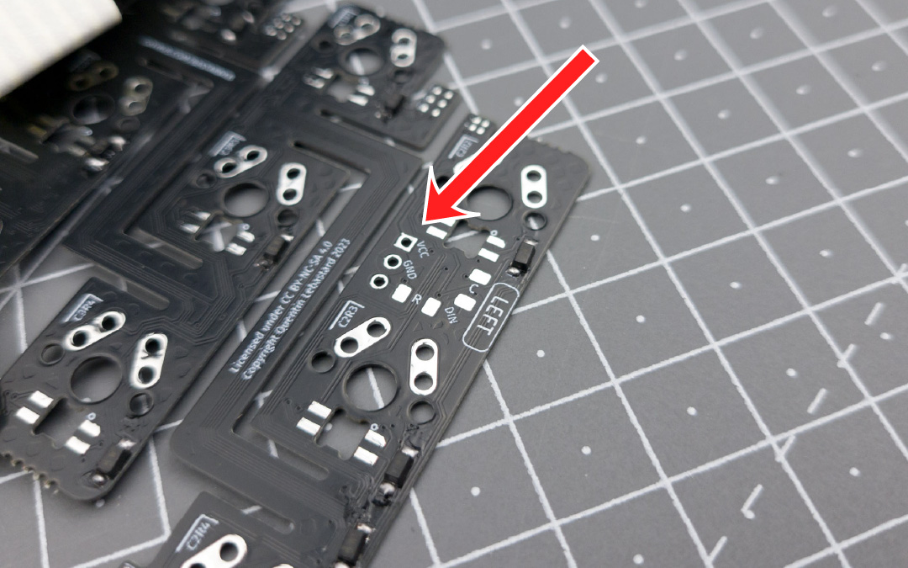

# Table of contents

1. TOC
{:toc}

# Introduction

In this section, we will connect the PCB plates to the Splinky shields using the flexible ribbon cables. This connects the switches to the "brain" of the keyboard, which can then read what you type.

There is the right side and left side, with plate and thumb cluster PCBs. It can get a bit confusing, but not to worry! We detailed everything, so just read the instructions carefully.

{: .note }
We will detail only the left side, as the right side is the same, but symmetric.

{: .tip }
If you are building with per-key RGB, there are some additional cables that came with your build. They are longer (100mm instead of 75mm). You can set them aside for now, we will install them later in this build guide.

# Cutting the cables

Before we can connect everything together, we need to cut the cables to the right length. 

**For the following step, please prepare:**

- 30-wire Ribbon cables (x1)

{: .tip }
If your kit came with 3 pieces of 12-wire ribbon cable, cut the pieces to match the picture and instructions below.

Cut the ribbon cable into:
- 5-ribbon cable (x2)
- 6-ribbon cable (x2)
- 4-ribbon cable (x2)
- use the picture below for reference

# Left side - plate PCB

We will start by installing the left side.

**For the following step, please prepare:**

- Left Plate PCB (x1)
- 6-wires ribbon cable (x1)
- 5-wires ribbon cable (x1)
- 4-wires ribbon cable (x1)

{: .tip }
Remember: by "left plate", we mean the one with the diodes visible when the "left" label is visible.

- Install the cables on the main ribbon cable cluster
- Use the pictures below for reference: **notice both the "LEFT" label and the SMD components are visible when the cables are installed from the top**
- Flip the PCB, and solder on the other side

# Left side - thumb cluster PCB

**For the following step, please prepare:**

- Left Plate PCB with ribbon cables (x1)
- 3-key thumb PCB (x1)

Identify the bottom ribbon cable: it has 4 cables, that's the one we will connect to the thumb cluster.

- Solder the bottom ribbon cable to the thumb cluster PCB just like previously
- Use the pictures below for reference: **notice both the "LEFT" label and the SMD components are visible on both PCBs when the cables are installed from the top**
  

# Installing the RGB cables (optional)

This step is optional, if you have per-key RGB.

{: .tip }
In this section, we will use pictures without the LEDs, **for illustration purposes**. **Make sure you installed the LEDs before going forward!**

## Preparing the cables

**For the following step, please prepare:**

- 6-wires ribbon cable (x1)
- 6-wires long ribbon cable (x1)

Cut the ribbon cables into pieces of 3-wires:

## Soldering the thumb cluster cables

**For the following step, please prepare:**

- 3-wires short ribbon cable (x1)
- Left-side PCB assembly

{: .warning }
Use the **short** cable for this step.

On the left side PCB assembly, identify the 3-pin connectors, there are:
- one at the bottom of the plate
- one on the thumb cluster PCB
- they are labeled VCC, GND, and Din/Dout
- use the picture below for reference

Solder the **short** ribbon cable to those 2 connectors, just like we did with the previous ones. Match **Din with Dout**.

## Soldering the plate cables

**For the following step, please prepare:**

- 3-wires long ribbon cable (x1)
- Left-side PCB assembly

{: .warning }
Use the **long** cable for this step.

On the left side PCB assembly, 
- identify the 3-pin connector at the top
- use the picture below for reference

Solder the **long** ribbon cable to this connectors, just like we did with the previous ones. 

# Right side - plate PCB

Do the same thing, but for the right side.

# Trim the cables

- Locate the other side of the PCB (the one opposite of the components)
- Locate the ribbon cables going out, they are protruding a bit
- Trim them to make sure they're as flush as possible with the surface of the PCB
