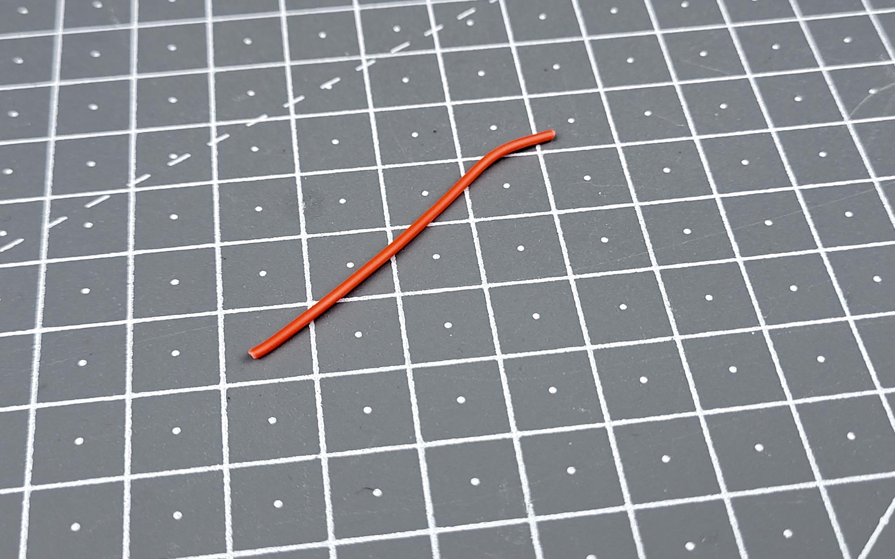
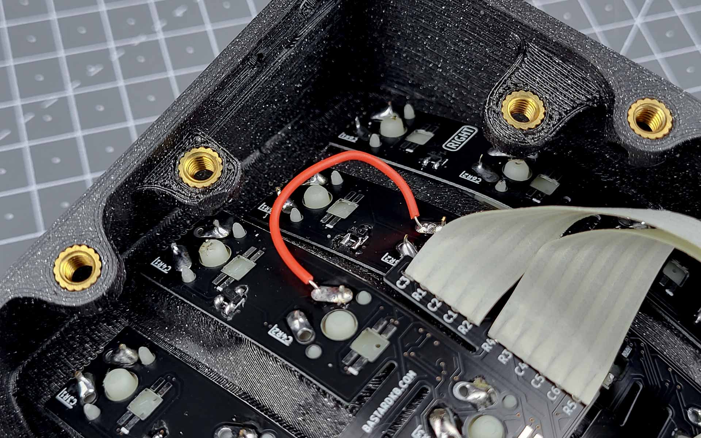

# Table of contents

1. TOC
{:toc}

# Introduction

A bodge wire is a connection that was not in the original design and is used to bypass a fault. This is typically recommended when a switch, row or column does not work.

The following guide will demonstrate how to diagnose a fault and how to apply the bodge.

# Diagnosing

If you have a switch, row or column not working, the first step is to determine what happened. Usually, this means there is a broken trace in the PCB - this means there's a connection that broke somewhere. 

We give some examples of how to diagnose this in the [diagnose a broken trace][broken] page.

Because it's difficult to give generic examples, we will instead provide a few examples of fixes.

# Required tools and hardware

You will need the following tools:

- wire
- wire stripper
- soldering iron
- soldering tin

{: .tip }
We recommend using solid core wire, around 28AWG. You can also use stranded wire, but will need to be careful so the strands don't go everywhere and make a short.

# I, O, P switches not working on 4x6 keyboard

In this example, we will fix an issue where the `I, O, P` switches stop working either permanently or temporarily. If this is happening to you, make sure to first confirm the diagnosis in the [diagnose a broken trace][broken] page.

## Preparing the bodge wire

{: .note }
Remember - you should use solid core (stranded will also work  but is not recommended)

First, cut a length of wire appropriate to connect both points.

Use your wire strippers to remove a small amount of insulation from both ends. The uninsulated tip should be a few millimeters long.

{: .warning }
If you do not have wire strippers, we do NOT recommend using scissors or a knife instead. If you must use a knife, please be very careful not to injure yourself or to cut the solid core.

## Soldering

Solder the wire to both points and take note of the uninsulated length:
- if it is too short, the insulation will be in the way
- if it is too long, the bare wire will be prone to touch another point and cause further issues in the future.

You can now plug your keyboard in and test your work. With any luck, the fault will be fixed!

No luck yet? Ask the community on [discord][discord]!

----

[Discord]: https://www.bstkbd.com/discord
[broken]: {{site.baseurl}}/help/diagnose_broken_trace.html